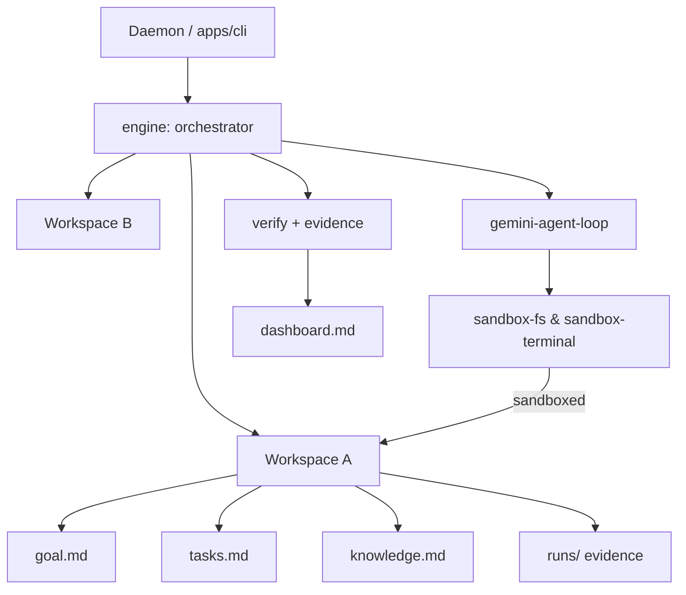

# Cognitive Substrate OS

A lightweight, local, **filesystem-first agentic task runner** built in TypeScript and
powered by Google Gemini. You give a workspace a goal; the engine decomposes it into
tasks, executes each one with a sandboxed tool-calling agent, **verifies the result and
records evidence to disk**, learns one thing, and shows you the state — all as plain
markdown you can read and edit.

It is deliberately *not* a chat bot and deliberately *not* magic: every piece of state
the OS holds is a file on your disk.

## What it does today (implemented)

- **Filesystem-first state.** No graph framework, no opaque DB. A workspace is a folder
  with `goal.md`, `tasks.md`, `knowledge.md`, `dashboard.md` and a `runs/` evidence
  trail — 100% auditable and human-editable.
- **Goal → task decomposition.** A high-level `goal.md` is broken into an ordered task
  queue. Without an API key the system still runs in a deterministic **simulation mode**.
- **Sandboxed tool-calling agent.** The agent reads/writes files and runs shell commands
  **confined to its workspace**. The filesystem sandbox enforces real path containment
  (resolved via `path.relative`, symlink-aware) — not a naive prefix check.
- **Verification with evidence.** Nothing is marked done without passing deterministic
  checks (and a skeptical LLM verifier when available). Each run writes
  `runs/<timestamp>/run.json` + `summary.md`.
- **MemGPT-inspired memory.** *Core memory* (immediate context) is separated from
  *archival memory* (`knowledge.md`), which the agent reads on demand via tools — one
  distilled lesson is appended per run.
- **Concurrent multi-workspace daemon.** Multiple workspaces are processed in parallel
  (async tool execution, no blocking the loop), with a real continuous daemon mode and
  graceful Ctrl-C shutdown.
- **Dynamic skills.** `SKILL.md` files are discovered from known global/local skill
  roots and offered to the agent; reads are restricted to those roots.

### Built out from the Vision

- ✅ **Eval harness** (`npm run eval`) — capability/regression/behavioral/adversarial/
  long-horizon categories with pass@1, time-to-pass and cost-to-pass metrics; runs
  offline and gates CI.
- ✅ **Self-improvement loop** — the `[improve]` queue is drained when `[now]` is empty;
  each failure proposes one concrete improvement, and the loop converges.
- ✅ **Governance** — per-task budgets, an approval gate that denies dangerous commands
  in autonomous mode, and an append-only `audit.log`.
- ✅ **Observability & recurring** — structured `incidents.jsonl`, incident counts on the
  dashboard, and a `[recurring]` queue with per-task cadence (`@every:N` ticks).
- ✅ **Multi-worker & multi-machine coordination** — pull-based, TTL-based task claiming.
  Choose the backend in `governance.json`: `local` (filesystem, one machine/shared volume)
  or `http` (a shared coordination server — `npm run coordinator` — so workers on
  different machines claim the same tasks safely; fail-safe if the server is down).
- 🟡 **Strong sandbox** — opt-in container execution (`"terminal":"container"`); runs
  shell commands inside an isolated Docker container, fail-safe if Docker is absent.
- 🟡 **Browser domain** — egress-gated web access. Stateless `fetchUrl` reads a page's
  text; the agent also has an interactive session (`browserNavigate`/`browserReadText`/
  `browserClick`/`browserType`/`browserScreenshot`) that drives a real headless browser
  when Playwright is installed (`npm i playwright`), and fails safe otherwise. Every
  navigation passes the domain allowlist; screenshots are written inside the workspace.

### Security, honestly

- **Filesystem & skills:** real, tested sandboxes (path containment, symlink-aware).
- **Terminal (native):** *not* a security boundary on its own — `cwd` is constrained with
  a hard 15s timeout, but a native shell can reach outside the workspace, and the
  destructive-command filter is an accident guard, not isolation.
- **What protects you:** the **governance approval gate** denies dangerous commands in
  autonomous mode (with an audit trail), and the **opt-in container sandbox**
  (`"terminal":"container"`) gives real isolation. Container-level isolation is the strong
  boundary; treat native mode as state isolation only.
- **Still:** don't run untrusted prompts on a machine you care about. Details in
  [`docs/ARCHITECTURE.md`](docs/ARCHITECTURE.md#security-model-be-precise-about-this).

## Roadmap (designed in the Vision, not yet built)

- ❌ **Desktop automation** — GUI control of arbitrary applications.
- ❌ **Full UX/interface doctrine** — ask bar, core views, approval UX (Vision part 7).
- ❌ **Company- & science-OS domains** — domain-specific capabilities (Vision part 8).

See [`docs/ESTADO-Y-PENDIENTES.md`](docs/ESTADO-Y-PENDIENTES.md) for the honest status and
concrete pending items.

## Getting Started

### 1. Prerequisites
- Node.js (v18+)
- A Google Gemini API Key (optional — without it, the OS runs in simulation mode).

### 2. Installation
```bash
git clone https://github.com/yourusername/cognitive-substrate-os.git
cd cognitive-substrate-os
npm install
npm run build
```

### 3. Configuration
Create a `.env` file in the root directory:
```env
GEMINI_API_KEY=your_key_here
```

### 4. Give it a goal
Create a workspace and a `goal.md` (the engine will decompose it into tasks):
```bash
mkdir -p workspaces/hello_world
echo "Crear un script Node.js que imprima 'hola' y guardar su salida en out.txt" \
  > workspaces/hello_world/goal.md
```
(You can also write an explicit `tasks.md` with `## [now]` items instead of a goal.)

### 5. Run
```bash
npm start          # one tick over all workspaces, then refresh the dashboard
npm run daemon     # continuous daemon (Ctrl-C to stop)
npm test           # the offline test suite (runs in simulation mode)
```
The OS scans `workspaces/`, decomposes goals, executes pending tasks with its file and
terminal tools, verifies results, writes evidence under each workspace's `runs/`, and
updates `dashboard.md`.

## Architecture



See [`docs/ARCHITECTURE.md`](docs/ARCHITECTURE.md) for the full picture and the runtime
capability matrix.

## Inspirations & Differentiators

This project builds on concepts from several state-of-the-art systems while staying
fully local and filesystem-first:

- **[Concept by Nir Feinstein](https://www.nirfeinste.in/)** — adopted the foundational
  concepts and the originating charter draft (now [`docs/vision/`](docs/vision/README.md)).
- **MemGPT** — the *Core* vs *Archival* memory hierarchy, mapped here to transparent
  local files instead of a vector DB.
- **Claude Code & Claude Agent SDK** — isolated subagent contexts and MCP-style tools;
  here state persists strictly through local markdown rather than ephemeral threads.
- **OpenAI Agents SDK & Deep Research** — separating exploratory research from execution.
- **Devin (Cognition)** — the closed-loop execute→review pattern, with the entire trace
  written as plain markdown on disk for transparency and rollback.

## Contributing
Pull requests welcome. Please keep the project's contract: transparent files over hidden
state, no completion without verification, sandboxed tools, and tests for domain logic.

## License
[MIT](LICENSE)
